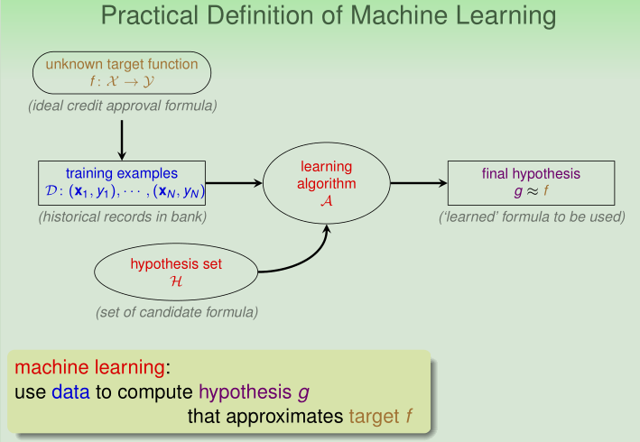
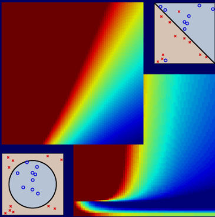
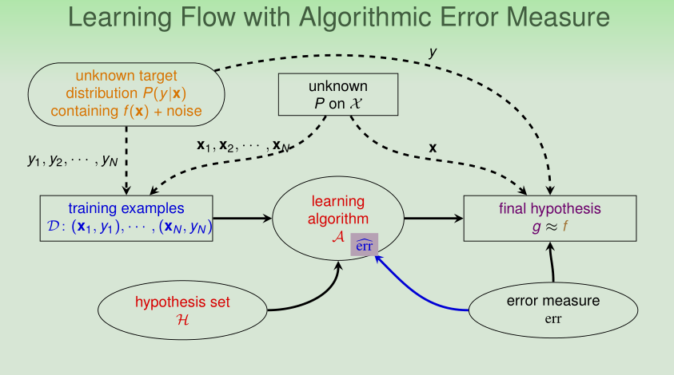
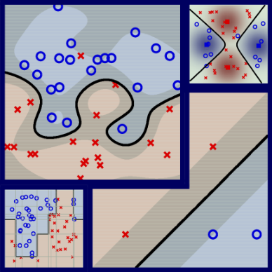
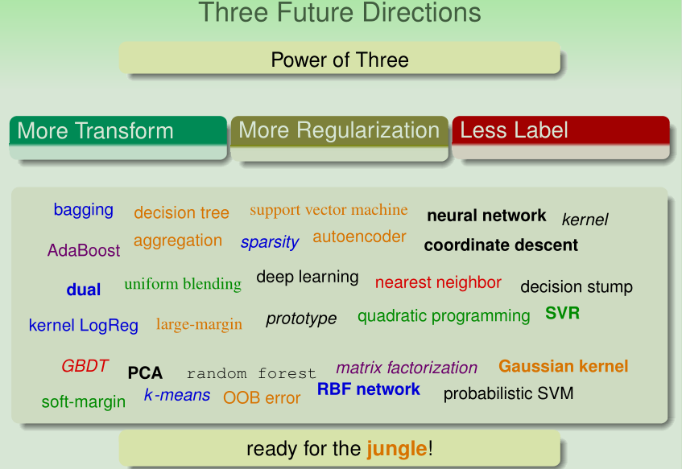

[TOC]

# Lecture 1 The Learning Problem
 
&emsp;&emsp;本篇博客是学习《Machine Learning Foundations》(机器学习基石)—— Hsuan-Tien Lin (林轩田)所做的学习笔记，其中图片和内容皆为林轩田老师团队的智慧结晶，版权所有皆归林轩田老师团队所有。
&emsp;&emsp;在此感谢林轩田老师团队的付出。
&emsp;&emsp;希望能与大家分享，一起学习，共同进步。

## Course Introduction

&emsp;&emsp;本课程是由台湾大学林轩田教授于2018秋季开设的《Machine Learning Foundations》(机器学习基石)，内含数学推导，丰富举例，老师诙谐有趣，生动活跃，是学习机器学习基础的优秀课程。

本课程主要从以下四个方面讲述Machine Learning:

- **When Can Machines Learn?**

- **Why Can Machines Learn?**

- **How Can Machines Learn?**

- **How Can Machines Learn Better?**
 

**像基石一样基础，像讲故事一样诙谐有趣。**

## What is Machine Learning

**learning**: for people(or other creatures)  acquiring **skill**
with experience accumulated from **observations**

**machine learning**: for computer, acquiring **skill**
with experience accumulated/computed from **data**

skill means **improving some performance measure**

学习就是获取知识和掌握技能的过程
人类根据视觉、听觉、嗅觉，味觉，触觉来感知世界，通过大脑加工，获取知识和掌握技能
计算机根据**数据**，通过**机器学习演算法**，探究数据之中**潜藏的规律**
 

### Key Essence of Machine Learning

(1)**pattern**(performance measure can be improved)
(2)**definition**(no programmable definition, so choose ML)
(3)**data**(computed from data about the pattern )
 

### Fun Time
**Which of the following is best suited for machine learning?** 
1.&nbsp;predicting whether the next cry of the baby girl happens at an even-numbered minute or not

2.&nbsp;determining whether a given graph contains a cycle

3.&nbsp;**deciding whether to approve credit card to some customer**&nbsp;$\checkmark$

4.&nbsp;guessing whether the earth will be destroyed by the misuse of nuclear power in the next ten years
 

**Explanation**
使用机器学习的三个要素：（1）要有规律；（2）不能直接编程实现规则；（3）要有数据。
1.预测一个小孩子奇数分钟哭还是偶数分钟哭，没有规律。
2.判断一个图形中是否有圆，可以直接编程实现。
3.给不给信用卡基于一定规则；这个规则直接编程效果不好；银行拥有大量基于用户信息发放信用卡的样本；满足三要素，这个实例将贯穿我们整个课程。
4.没有训练数据（地球目前还未因为核爆炸毁灭过）。
 

  

## Applications of Machine Learning

**机器学习**是一种**构建复杂系统**的**可替代方案**。

- 衣
  &emsp;Abu-Mostafa, 2012
  根据销售数据和用户调查，推荐衣物穿搭风格。
-   食
  &emsp;Sadilek et al., 2013
  根据推特用户的评语及定位，探究一家餐馆食物中毒的可能性:-)
-   住
  &emsp;Tsanas and Xifara, 2012
  根据建筑物的特征和它们的能源消耗，预测它们附近建筑物的能源消耗。
-   行
  &emsp;Stallkamp et al., 2012
  根据交通标识图片及其含义，准确识别交通标志的含义。
-   育
  &emsp;根据学生在数学辅导系统中的测试及记录，判断学生是否能做对一道题。
-   娱乐
  &emsp;competition held by Netflix in 2006
  根据用户对电影的评分，预测用户对未观赏电影的评分。

**机器学习无处不在**
 

### Fun Time
**Which of the following field cannot use machine learning?** 
1.&nbsp;Finance

2.&nbsp;Medicine

3.&nbsp;Law

4.&nbsp;**None of the above** &nbsp;$\checkmark$

**Explanation**
机器学习应用广泛(衣食住行育等)，无所不在。
 

## Components of Machine Learning

Metaphor Using Credit Approval

| property  | value  |
| :--: | :--: |
| age | 23 years |
| annual salary | NTD 1,000,000 |
| year in residence | 1 year |
| year in job | 0.5 year |
| current debt | 200,000 |

### Basic Notations

- input: $x ∈ X$ (i.e. customer application)
- output: $y ∈ Y$ (i.e. good/bad after approving credit card)
- unknown pattern to be learned ⇔ target function:
  $f : X → Y$ (i.e. ideal credit approval formula)
- data ⇔ training examples: D = {$(x_1,y_1),(x_2,y_2), ··· ,(x_N~ ,y_N~)$ (i.e. historical records in bank)
- hypothesis set $H$ : set of candidate formula(i.e. {annual salary > NTD 800,000, debt > NTD 100,000,  year in job ≤ 2, ...})
- hypothesis ⇔ skill with hopefully good performance:
  $g: X → Y$ (‘learned’ formula to be used)
- learning algorithm $A$ : the method to approximate target f  

**Learning Model** = $A$ and $H$

**Machine Learning**: use data to compute hypothesis g that approximates target f.

$$
f:X_D{\longrightarrow}Y_D
\\ g:X{\longrightarrow}Y
\\ H\stackrel{D,A}{\longrightarrow}f \approx g
$$

 

### Fun Time
**How to use the four sets below to form a learning problem for song recommendation?**
&nbsp;&nbsp;&nbsp;&nbsp;$S_1$ = [0,100]
&nbsp;&nbsp;&nbsp;&nbsp;$S_2$ = all possible (userid, songid) pairs
&nbsp;&nbsp;&nbsp;&nbsp;$S_3$ = all formula that ‘multiplies’ user factors & song factors,indexed by all possible combinations of such factors
&nbsp;&nbsp;&nbsp;&nbsp;$S_4$ = 1,000,000 pairs of ((userid, songid), rating)
1.&nbsp;$S_1 = X,S_2 = Y,S_3 = H,S_4 = D$

2.&nbsp;$S_1 = Y,S_2 = X,S_3 = H,S_4 = D$ &nbsp;$\checkmark$

3.&nbsp;$S_1 = D,S_2 = H,S_3 = Y,S_4 = X$

4.&nbsp;$S_1 = X,S_2 = D,S_3 = Y,S_4 = H$

 
**Explanation**
$S_1 = Y$为用户对歌曲的评分集；
$S_2= X$为用户和歌曲的集合；
$S_3 = H$为用户喜好歌曲因素的集合；
$S_4 = D$为样本数据；
 

## Machine Learning, Data Mining, Statistics and Artificial Intelligence

**Machine Learning**(机器学习):use data to compute hypothesis g that approximates target f.
**Data Mining**(数据挖掘):use (huge) data to find property that is interesting.
**Statistics**:use data to make inference about an unknown process.
**Artificial Intelligence**:compute something that shows intelligent behavior.

机器学习侧重**潜藏规律**，数据挖掘侧重**关联属性**,他们互帮互助，密不可分。

统计学是数学的一个分支，很多**工具用于机器学习**。

从广义上说，人工智能是使某些事物表现出智能的技术，而**机器学习是实现人工智能的一种方式**。

 

### Fun Time
**Which of the following claim is not totally true?**
1.&nbsp; machine learning is a route to realize artificial intelligence

2.&nbsp; machine learning, data mining and statistics all need data

3.&nbsp; **data mining is just another name for machine learning** &nbsp;$\checkmark$

4.&nbsp; statistics can be used for data mining
 

**Explanation**
机器学习和数据挖掘很类似，但两者有所侧重，不是同一个概念。
 

## Summary

 

### 讲义总结
$$
\\ H\stackrel{D,A}{\longrightarrow}f \approx g
$$
 

### 机器学习基石课程总结
**学完这门课，大家最终会掌握机器学习的完整概念和流程。**

 

### 机器学习技法课程预告

**学完这门课，可以继续学进阶课程——《Machine Learning Techniques》(机器学习技法)，大家最终会学习和掌握各种不同的机器学习算法。**

 

### 参考文献
<a href="https://www.csie.ntu.edu.tw/~htlin/course/mlfound18fall/">《Machine Learning Foundations》(机器学习基石)—— Hsuan-Tien Lin (林轩田)</a>
<a href="https://www.csie.ntu.edu.tw/~htlin/course/mltech18spring/">《Machine Learning Techniques》(机器学习技法)—— Hsuan-Tien Lin (林轩田)</a>
