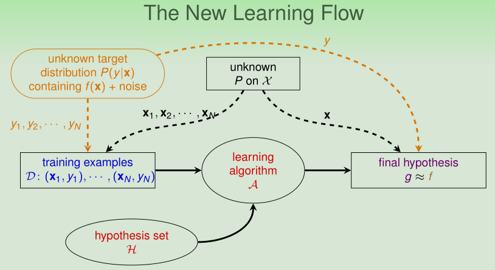

[TOC]

# Lecture 8: Noise and Error
 

## Noise and Probabilistic Target
&emsp;&emsp; can replace $f(x)$ by $P(y|x)$
 

### Noise
&emsp;&emsp; noise in y, i.e. good customer, ‘mislabeled’ as bad.
&emsp;&emsp; noise in y: i.e. same customers, different labels.
&emsp;&emsp; noise in x: i.e. inaccurate customer information.
 

### Probabilistic Target
**Deterministic Distribution**
$$
\begin{array}{l} 
\mathbf{x} \sim P(\mathbf{x})
\\ y =  f(\mathbf{x}) \ \text{with} \ P(y | \mathbf{x}) = 1
\\ i.e. P(o | \mathbf{x})=1, P( \times | \mathbf{x})=0
\end{array}
$$

**Probabilistic Distribution**
$$
\begin{array}{l} 
\mathbf{x} \sim P(\mathbf{x})
\\ y =  f(\mathbf{x}) \ \text{with} \ 0\ \le P(y | \mathbf{x}) \le 1
\\ i.e. P(o | \mathbf{x})=0.7, P( \times | \mathbf{x})=0.3
\end{array}
$$
之前阐述的决定分布是概率分布的一种特殊情况（$P(y | \mathbf{x}) = 1$）。

现在是在概率分布$P(y | \mathbf{x})$中学习，包含$f(\mathbf{x})$和噪音（**noise**）。

 
只是在原有的**数据分布**中，加上**条件概率**，不影响原来**VC Bound**的推导及使用。

 

### Fun Time
Let’s revisit PLA/pocket. Which of the following claim is true?
1 In practice, we should try to compute if $D$ is linear separable before deciding to use PLA.
2 If we know that $D$ is not linear separable, then the target function $f$ must not be a linear function.
3 If we know that $D$ is linear separable, then the target function $f$ must be a linear function.
4 **None of the above**  &nbsp;$\checkmark$
 
**Explanation**
1 如果我们可以计算$D$是否线性可分，那么就能直接获取$W^*$，就无需使用PLA算法。
2 数据集线性不可分，可能存在***噪音**，真实数据集线性可分
3 数据集线性可分，可能收集的**数据少**，存在**巧合**，并不一定说明目标函数一定是线性函数。
:-)

 

## Error Measure

$$
E_{\mathrm{in}}(g)=\frac{1}{N} \sum_{n=1}^{N} \operatorname{err}\left(g\left(\mathbf{x}_{n}\right), f\left(\mathbf{x}_{n}\right)\right)
\\
E_{\text {out}}(g)=\underset{\mathbf{x} \sim P}{\mathcal{E}} \operatorname{err}(g(\mathbf{x}), f(\mathbf{x}))
$$
**训练数据**是有限的，使用离散分布列计算平均错误。
**预测数据**是无限的，使用概率分布计算平均错误。
以后会学到**测试数据**，我们使用测试数据代替预测数据，来判断学习模型的好坏。

### 0/1 error

also called **classification error**.
$$
\operatorname{err}(\tilde{y}, y)=[\tilde{y} \neq y]
\\ f(\mathbf{x})=\underset{y \in \mathcal{Y}}{\operatorname{argmax}} P(y | \mathbf{x})
$$

### squared error 
$$
\operatorname{err}(\tilde{y}, y)=(\tilde{y}-y)^{2}
\\ f(\mathbf{x})=\sum_{y \in \mathcal{Y}} y \cdot P(y | \mathbf{x})
$$

&emsp;&emsp; affect ‘ideal’ target
 

###  Ideal Mini-Target
$P(y | \mathbf{x})$ and **err measure** define **ideal mini-target $f(\mathbf{x})$.
 

## Algorithmic Error Measure
&emsp;&emsp; user-dependent $=>$ plausible or friendly
 

## Weighted Classification
&emsp;&emsp; easily done by virtual ‘example copying’
 

## Summary
本篇讲义主要讲了模型复杂度，数据数量级以及VC Bound的宽松程度。

在有限的$d_{\mathrm{vc}}$，足够大的$N$，足够小的$E_{in}$，我们真正能学到模型。

 

### 讲义总结

**Noise and Probabilistic Target**
&emsp;&emsp; can replace $f(x)$ by $P(y|x)$
 

**Error Measure**
&emsp;&emsp; affect ‘ideal’ target
 

**Algorithmic Error Measure**
&emsp;&emsp; user-dependent $=>$ plausible or friendly
 

**Weighted Classification**
&emsp;&emsp; easily done by virtual ‘example copying’
 

### 参考文献
<a href="https://www.csie.ntu.edu.tw/~htlin/course/mlfound18fall/">《Machine Learning Foundations》(机器学习基石)—— Hsuan-Tien Lin (林轩田)</a>