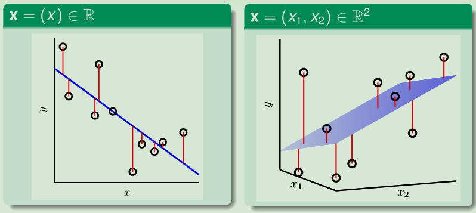

[TOC]

# Lecture 9: Linear Regression
 

## Linear Regression Problem
将之前的**信用卡发放**问题演变成**信用卡额度**问题。
$$
Y = R
\\y \approx \sum_{i=0}^{d} w_{i} x_{i}
\\ \text{linear regression hypothesis}:h(\mathbf{x})=\mathbf{w}^{T} \mathbf{x}
$$
线性回归和线性分类相比，去掉了sign函数。
 

### linear regression

**linear regression**: find lines/hyperplanes with small residuals
&emsp;&emsp;use hyperplanes to approximate real values
 

### Fun Time
Consider using linear regression hypothesis h(x) = w T x to predict the credit limit of customers x. Which feature below shall have a positive weight in a **good hypothesis** for the task?
1 birth month
2 **monthly income** &nbsp;$\checkmark$
3 current debt
4 number of credit cards owned
 
**Explanation**
相对来说，信用卡额度与月收入成正相关。 :-)

 

## Linear Regression Algorithm
&emsp;&emsp;analytic solution with pseudo-inverse
 

## Generalization Issue
&emsp;&emsp;$E_{\text { out }}-E_{\text { in }} \approx \frac{2(d+1)}{N}$on average
 

## Linear Regression for Binary Classification
&emsp;&emsp;0/1 error ≤ squared error
 

## Summary
本篇讲义主要讲了噪音，概率目标，损失函数，以及带权重的模型。

在分布函数$P(y | \mathbf{x})$和低损失$E_{in}$下，我们真正能学到模型。

 

### 讲义总结

**Linear Regression Problem**
&emsp;&emsp;use hyperplanes to approximate real values
 

**Linear Regression Algorithm**
&emsp;&emsp;analytic solution with pseudo-inverse
 

**Generalization Issue**
&emsp;&emsp;$E_{\text { out }}-E_{\text { in }} \approx \frac{2(d+1)}{N}$on average
 

**Linear Regression for Binary Classification**
&emsp;&emsp;0/1 error ≤ squared error
 

### 参考文献
<a href="https://www.csie.ntu.edu.tw/~htlin/course/mlfound18fall/">《Machine Learning Foundations》(机器学习基石)—— Hsuan-Tien Lin (林轩田)</a>

